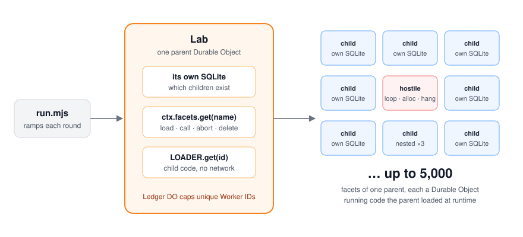

# facets-stress-test

How far can one Cloudflare Durable Object go as a parent of
[facets](https://developers.cloudflare.com/dynamic-workers/usage/durable-object-facets/),
children it creates at runtime, each a Durable Object with its own SQLite, running code
loaded by [Worker Loader](https://developers.cloudflare.com/workers/runtime-apis/bindings/worker-loader/)?

The docs say a Durable Object "can have any number of facets" and stop there. This repo pushes one
parent until something gives. It measures memory, hostile children, everyone-at-once, nesting and
churn, and reports what happened. No AI calls. A full production run used 484 unique Dynamic Workers,
inside the 1,000 a month that are included.



## What we found (production, 2026-10-08)

| Test | Result |
|---|---|
| 5,000 tiny children in one parent | Never broke. Load latency went from 31 to 62 ms p50. The parent never restarted. |
| Still warm afterwards? | 0 of 5,000. Idle children get unloaded while the parent stays alive. Reloading took ~95 ms each. |
| 400 children holding 1 MB each (400 MB, well over the 128 MB isolate limit) | Never broke. 6 stayed warm, 394 had been reloaded. **Memory pressure unloads children, not the parent.** |
| Children that each use their own Dynamic Worker | 400 at 32-35 ms p50; 200 at 8 MB each, 35-57 ms p50. |
| Load, ping, unload, repeated | 1 ms p50 sharing one Worker, 11 ms p50 with a new Worker each time. |
| Everyone at once | 500 children sharing one Worker: 500/500 in 179 ms. 40 children with 40 different Workers: 10/40 succeed, which matches the documented limit of 10 distinct Dynamic Workers in flight per Durable Object. |
| A child loops forever, eats memory, recurses, or throws | Each is stopped ("exceeded CPU time limit", "exceeded memory limit", "Maximum call stack size exceeded"). The parent survives every time. A canary sibling stayed warm through the loop, the memory bomb and the throw. |
| A child calls `fetch()` | Refused. Loaded code has no network unless you hand it a binding. |
| A child returns 100 MB / writes 256 MB to its SQLite | Both fine. |
| A child hangs forever | Only the parent's own timeout catches it. The parent survives, but the canary sibling had been unloaded. |
| Facets inside facets | Stops at depth 4 counting the root: "Facet nesting depth limit exceeded". This limit isn't in the docs. |

Details and raw numbers: [FINDINGS.md](FINDINGS.md) and [`results/`](results/).

### The surprise: `abort()` on children that wrote storage resets the parent

If the parent unloads children with `ctx.facets.abort()`, and those children wrote anything to their
own storage (SQL or KV), the **parent** gets reset after roughly 20-30 of them:
`Internal error in Durable Object storage caused object to be reset`.

| Children... | 100 in one parent |
|---|---|
| wrote storage, then `abort()` | parent reset, somewhere between child #18 and #32 depending on what is written |
| wrote storage, then `delete()` | fine |
| wrote storage, left alone | fine |
| wrote nothing, then `abort()` | fine |

It's a running total per parent instance, not per request. It happens with a class bundled in the
Worker too, so Worker Loader isn't involved. [`repro/`](repro/README.md) is one ~110-line Worker
that shows it with one `curl`.

**If you build on facets:** don't `abort()` children that have written storage. The runtime unloads
idle children by itself, as the 5,000-child test above shows. Use `delete()` when you're done with a
child's data.

## Run it yourself

You need Node 20+ and a Cloudflare account on the Workers Paid plan. Dynamic Workers (Worker Loader)
are paid-only.

```sh
git clone https://github.com/acoyfellow/facets-stress-test
cd facets-stress-test
npm install

# 1. Local (fast, free, but no production memory/CPU limits)
echo 'TOKEN=dev' > .dev.vars
npm run dev                                           # http://localhost:8799
SCALE=0.1 node run.mjs http://localhost:8799 dev local

# 2. Production
npx wrangler secret put TOKEN                         # any long random string
npx wrangler deploy --var EXPIRES:2026-12-01T00:00:00Z   # optional self-destruct date
node run.mjs https://facets-stress-test.<you>.workers.dev <token> prod
node run.mjs <url> <token> prod hoard,hostile         # or only some rounds

# 3. Clean up
npx wrangler delete
```

Each run writes `results/<target>-<time>.json` and wipes its labs, including all child storage,
unless you set `KEEP=1`.

Rounds: `hoard` (load and keep), `swarm` (create, write, unload: in production this is the round that
hits the reset above, at child #18), `churn`, `stampede`, `hostile`, `nest`.
Local runs use `SCALE=0.1` and skip the memory bomb, since local mode would just use up your own RAM.

The minimal repro has its own Worker: `npm run repro:deploy`, then see [repro/README.md](repro/README.md).

### What it costs, and the guard rails

- **Dynamic Workers are [billed](https://developers.cloudflare.com/dynamic-workers/pricing/) per unique
  Worker ID per day** after the first 1,000 a month. Most rounds
  share a handful of IDs. A `Ledger` Durable Object counts every unique ID and refuses to go past 1,500
  for the whole deployment (`LIMITS` in [`src/index.js`](src/index.js)). Our full run used 484.
- At most 500 children per request and 200,000 per lab.
- Every request needs `Authorization: Bearer <TOKEN>`. `EXPIRES` turns the Worker into a 410 after a date.
- No AI, no outbound network from children.

## Layout

```
src/index.js     Lab (the parent) and Ledger Durable Objects, plus the HTTP entry point
src/child.js     generates the child module source (padding, hold memory, write, nest, hostile modes)
run.mjs          driver: ramps each round until it breaks or hits a cap, saves results JSON
results/         raw production and local results from 2026-10-08
repro/           minimal Worker for the storage reset, with its own README
```

## Caveats

- Measured on one day (2026-10-08) on one account with compatibility date `2026-09-04`. Facets are new,
  and limits and behavior may change.
- Latencies are timed inside the parent, around each call to a child. Everything ran from one location.
- Local `wrangler dev` crashed at ~4,250 hoarded children, while production reached the 5,000 cap.
  Treat local runs as a check that the harness works, not as measurements.

MIT licensed.
